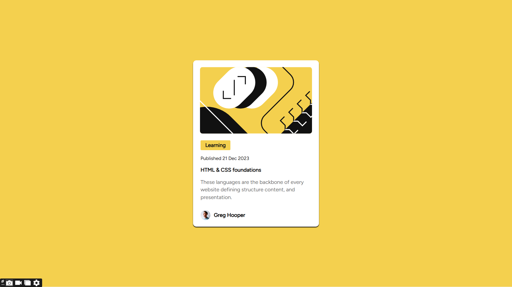

# Frontend Mentor - Blog preview card solution

This is a solution to the [Blog preview card challenge on Frontend Mentor](https://www.frontendmentor.io/challenges/blog-preview-card-ckPaj01IcS). Frontend Mentor challenges help you improve your coding skills by building realistic projects. 

## Table of contents

- [Overview](#overview)
  - [The challenge](#the-challenge)
  - [Screenshot](#screenshot)
  - [Links](#links)
- [My process](#my-process)
  - [Built with](#built-with)
  - [What I learned](#what-i-learned)
  - [Continued development](#continued-development)
  - [Useful resources](#useful-resources)
- [Author](#author)
- [Acknowledgments](#acknowledgments)

**Note: Delete this note and update the table of contents based on what sections you keep.**

## Overview

### The challenge

Users should be able to:

- See hover and focus states for all interactive elements on the page

### Screenshot



### Links
- Live Site URL: [live site URL here](https://blog-card-blush.vercel.app/)

## My process

### Built with

- Semantic HTML5 markup
- CSS custom properties
- Flexbox

### What I learned
Now, i can properly center a div with no hassle, thanks to this project, you Tube and this article on [medium](https://medium.com/front-end-weekly/5-ways-i-would-center-a-div-why-the-last-is-my-favorite-c1c54b44ac58)

```html
<h1>Some HTML code I'm proud of</h1>
```
```css
@font-face {
  font-family: 'Figtree';
  src: url('assets/fonts/Figtree-VariableFont_wght.ttf') format('truetype');
  font-weight: normal;
  font-style: normal;
}

@font-face {
  font-family: 'Figtree';
  src: url('assets/fonts/Figtree-Italic-VariableFont_wght.ttf') format('truetype');
  font-weight: normal;
  font-style: italic;
}
```

### Continued development

While working on this project, i was struggling with media query. It took me more hours to make it responsive on the smaller mobile devices than completing the project itself. I definitely have to dive more on media query, make research and become proficient in implementing it.

**Note: Delete this note and the content within this section and replace with your own plans for continued development.**

### Useful resources

- [5 Ways I Would Center A Div Why The Last Is My Favorite](https://medium.com/front-end-weekly/5-ways-i-would-center-a-div-why-the-last-is-my-favorite-c1c54b44ac58) - This helped me for centering the blog card. I really liked the last pattern and i will probably use it going forward.

## Author

- Website - [Dev_Frank](https://medium.com/@Dev_Frank)
- Frontend Mentor - [@Phrank08](https://www.frontendmentor.io/profile/Phrank08)
- Twitter - [@enehfranklyn8](https://www.twitter.com/enehfranklyn8)


## Acknowledgments

[Kevin Powell](https://youtu.be/u044iM9xsWU?si=1vqljXrXIVcRkFT_)'s you tube video on CSS flexbox help me in completing this project. Also shoutout to Dev_Frank's [medium](https://medium.com/front-end-weekly/5-ways-i-would-center-a-div-why-the-last-is-my-favorite-c1c54b44ac58) article was really helpful too. 

